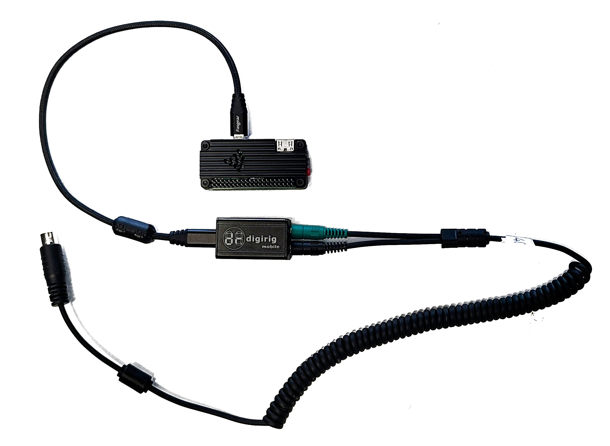

# PiTNC [1.02]

PiTNC provides a robust bluetooth and WIFI accessible TNC. When connected to a compatible mobile or base station full APRS and Winlink KISS interface is available on Bluetooth or a TCP/IP port.

The following APRS applications are supported: APRSDroid (Android), aprs.fi (iOS), YAAC (Windows and Mac), and Ham Tracks (Android).

# Required Components

| Item | Price (Aprox) | Purchase Link |
| ---- | ------------- | ------------- |
| Raspberry Pi W | $15.00 | https://www.pishop.us/product/raspberry-pi-zero-w/ |
| Micro USB Power Supply | $7.95 | https://www.pishop.us/product/wall-adapter-power-supply-micro-usb-2-4a-5-25v/ |
| 16Gb SD Card (larger okay) | $9.00 | https://a.co/d/7Zhavrw |
| Raspberry Pi Case | $9.99 | https://a.co/d/iUEp1YX |
| Micro USB to USB C cable | $6.00 | https://a.co/d/3dWxvo8 |
| Digirig | $50.00 | https://digirig.net/product/digirig-mobile/ |
| Digirig Interface Cable to Radio | ~$30.00 | Search for your radio and select the appropriate cable: https://digirig.net/store/ |
| Ferrites (Optional) | $9.99 | https://a.co/d/3dWxvo8 |



# Writing PiTNC Image to SD Card (Win32 Disk Imager)

1. **Dwonload and unzip the latest PiTNC image file**
   - Image file can be downloaded from https://www.vena.com/pitnc/pitnc_master_rev102.zip
   - Unzip the image file by right-clicking and selecting `Extract all...`
   
2. **Download and Install Win32 Disk Imager**
   - Visit the [official Win32 Disk Imager website](https://sourceforge.net/projects/win32diskimager/) to download the software.
   - Follow the installation instructions to install Win32 Disk Imager on your Windows computer.

3. **Insert SD Card**
   - Insert the blank SD card into your computer's SD card reader.

4. **Open Win32 Disk Imager**
   - Launch Win32 Disk Imager on your computer. You may need to run it as an administrator.

5. **Select Raspberry Pi Image File**
   - Click on the folder icon in the "Image File" field.
   - Navigate to and select the file you unzipped `pitnc_master_revXXX.img`

6. **Choose Target Device**
   - In the "Device" field, select the drive letter corresponding to your SD card. 

  
   > [!WARNING]  
   > Be careful to choose the correct drive to avoid data loss.

7. **Write Image to SD Card**
   - Click the "Write" button to begin the writing process.
   - Confirm the action when prompted, as this will overwrite all data on the selected SD card.

8. **Wait for Completion**
   - Allow Win32 Disk Imager to complete the writing process. This may take some time, depending on the size of the image file.

9. **Verify Write Completion**
   - Once the process is complete, Win32 Disk Imager will display a confirmation message.

# Editing the pitnc.conf file on SD Card

In the root directory of the PiTNC SD Card is a file `pitnc.conf`. This configuration file allows for initual setup of your WIFI connectivity. When the Raspberry Pi boots the WIFI information will be automatically configured and will connect to your local WIFI.

1. Open `pitnc.conf` in a text editor like Notepad

2. The contents of the file are as shown:
   ```
   # PiTNC BOOT Configuration file.
   # This file is checked durring boot. If settings are changed and the pi is in read/write
   # mode, the settings are applied.
   
   # WIFI
   # NOTE: Must leave a space after colon. Example: ssid: MyWifiSsid
   #       See https://yaml.org/
   wifi:
       ssid: 
       password: 
   
   # FILE SYSTEM
   # Set fsmode to 1 to make file system READ ONLY
   # Set fsmode to 2 to make file system READ WRITE
   # Set fsmode to 3 to leave the file system mode unchanged
   fsmode: 3
   ```
3. Enter your WIFI SSID (name of your wifi network) after `ssid: `
   ```
   ssid: <your wifi ssid>
   ```
4. Enter your WIFI Password after `password: `.
   ```
   password: <your wifi password>`
   ```
   
   > [!NOTE]  
   > Make sure to leave a space after the `:`. This is a YAML file format requirement.
5. Save the file.
6. Safely eject the SD Card from your computer.

# SSH Into you PiTNC

After the Raspberry Pi boots up, if the configuration was done correctly it should connect to your local WIFI.

1. From the command prompt on your computer (Windows PowerShell for example). Type the following at the prompt:
   ```console
   $ ssh tnc@pitnc.local
   ```
2. You will be prompted for the password. The default password is **1200baud**. This can be changed after logging into the device.

3. The following information will be displayed:
   ```console
   ======================================
               _ __
        ____  (_) /_____  _____
       / __ \/ / __/ __ \/ ___/
      / /_/ / / /_/ / / / /__
     / .___/_/\__/_/ /_/\___/
    /_/  Ham Tracks Offroad

   ======================================
   
   BLUETOOTH NAME: pitnc <YOUR BLUETOOTH MAC>
    BLUETOOTH MAC: <YOUR BLOOTOOTH MAC>
       IP ADDRESS: <YOUR IP ADDRESS>
             WIFI: <YOUR WIFI>
    TNC KISS PORT: 8001
      FILE SYSTEM: READ/WRITE
   
   usage: pitnc.py [-h] [-s] [-i] [-a] [--drestart] [--dmonitor] [-r | -w]
   
   pitnc configuration tool
   
   optional arguments:
     -h, --help       show this help message and exit
     -s, --splash     display the splash screen.
     -i, --info       display the system info.
     -a, --addwifi    add a wifi network.
     --drestart       restart direwolf (after any modifications to direwolf.conf)
     --dmonitor       enter direwolf activity monitor.
     -r, --readonly   make the file system read only.
     -w, --readwrite  make the file system read and write.
   ```


   
