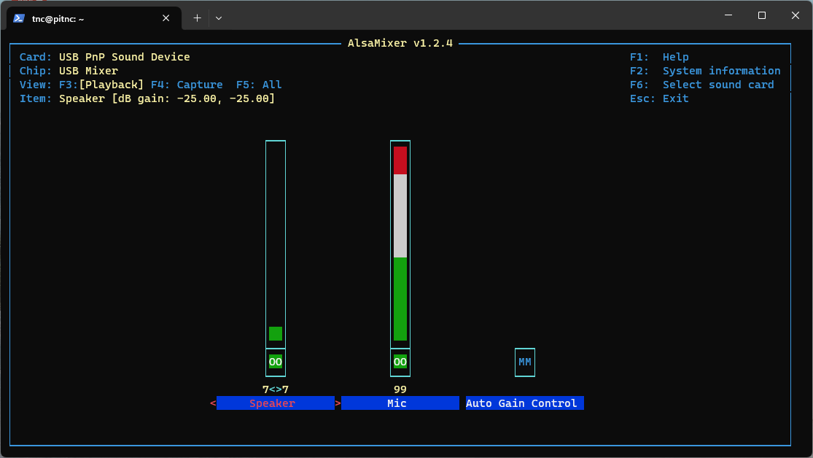

# Adjusting audio levels

1. SSH into PiTNC

```console
ssh tnc@pitnc.local
```

3. Run alsamixer

```console
alsamixer
```

3. Select the correct audio device by pressing **F6** and then select **USB PnP Sound Device**


4. Use the **left** and **right** arrows to select the input or output. Then use **up** or **down** arrows to select the volume or gain.

5. To save, press **ESC**. Then enter the following command to save your settings:

```console
sudo alsactl store
```
